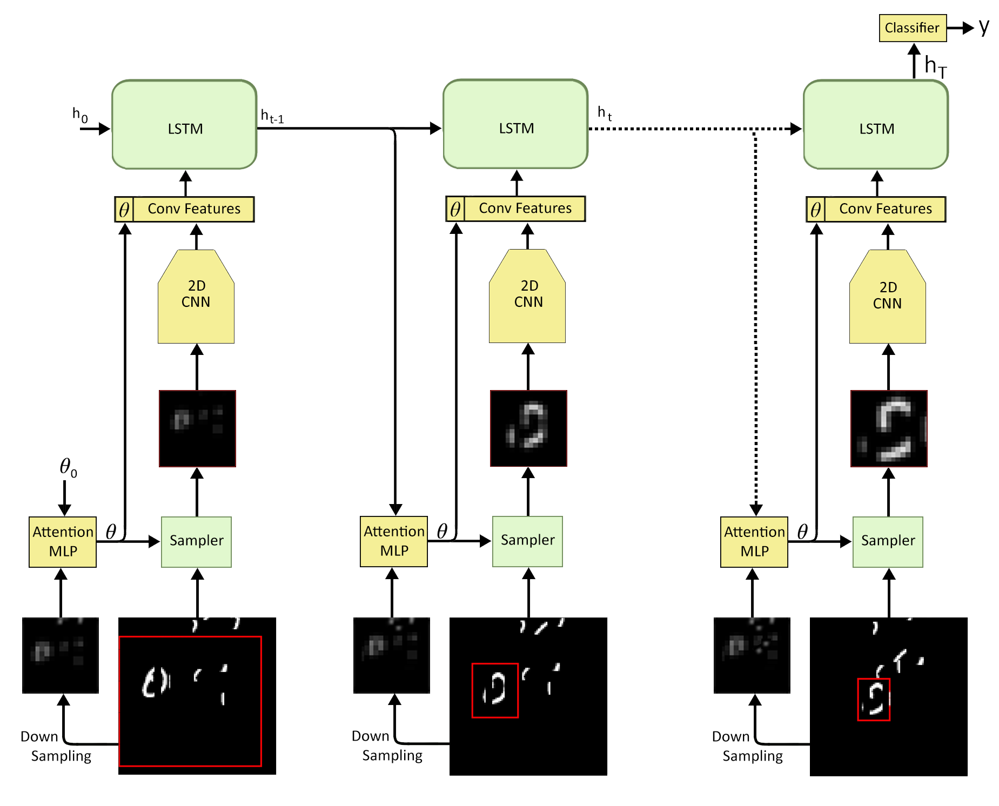
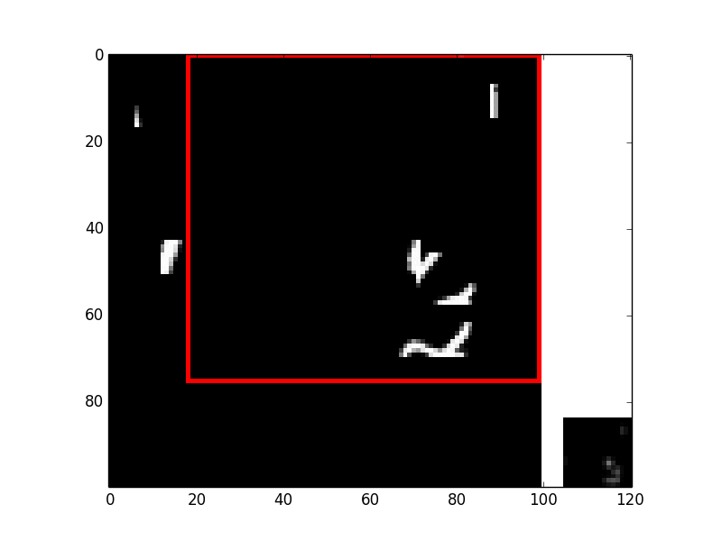
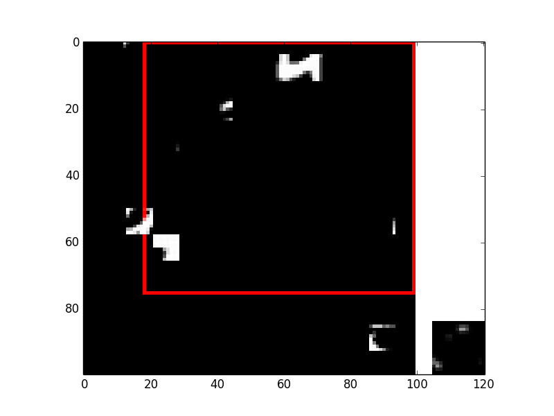
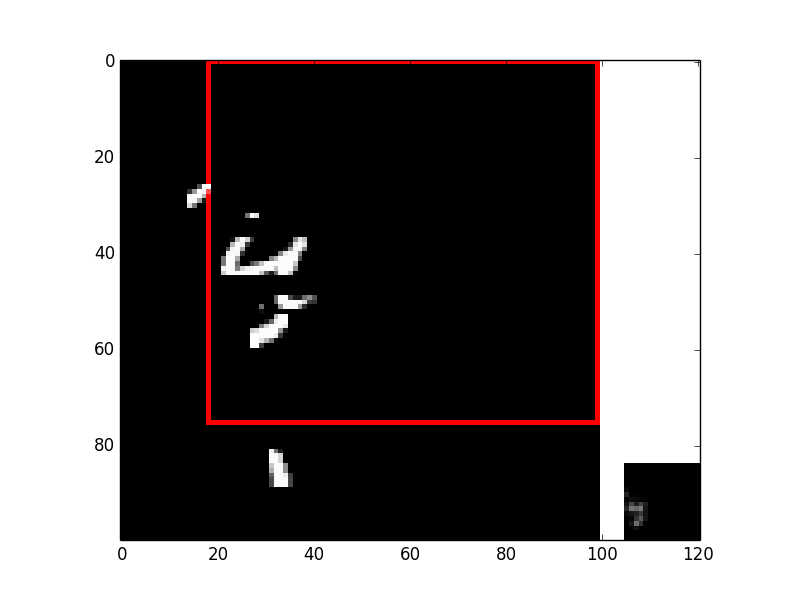

# LSTM-Attention on videos
This repository was built in October 2015 mainly in Blocks (Theano-based Framework developed in MILA by Bart Van Merriënboer et al.)
The code is not maintained and the work is not presented in any conferences/workshops or arXived. (We don't have any plan to arXiv or submit this work)

# Method
Attention models have shown successful outputs on images. This work explores visual attention models on videos via employing a differentiable attention mechanism to apply a two-dimensional convolutional neural network on salient regions of consecutive frames with varying resolutions.
The goal of the work is to do video classification. This is a very short summary of the model.

# Synthetic MNIST-Cluttered-bar dataset for the task of video classification
This toy dataset is not much different with cluttered MNIST video dataset and we just added some bars on the frames to make sure it is hard to recognize the digit from a few frames.

# Real dataset:
We tried our approach on the MPII Cooking dataset. It (the attention cropper) was overfitting on people cloths, and was failed to learn useful information for the classification.

# The architecture:

# Some visual results

# Interesting papers about attention
Many papers were released on attention and particularly in "attention in videos". 
Here there are two papers on action classification in videos by employing attention:
Spatio-Temporal attention:
Action Recognition using Visual Attention
Temporal attention:
End-to-end learning of action detection from frame glimpses in videos
 
